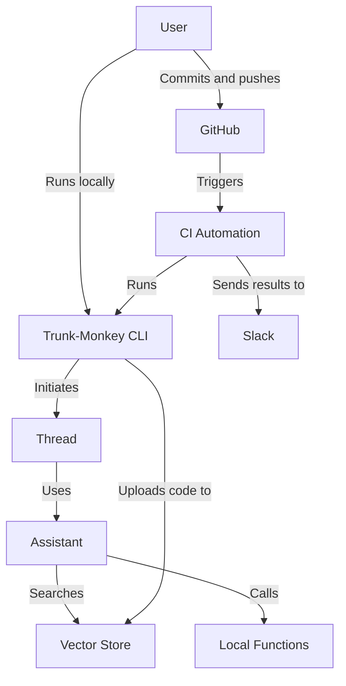

# Architecture

## Current

## Design ideas
- Automatically triggered checks
- Git actions such as blame, history and diff implemented functions
- Source code is uploaded(some sub parts of it) by schedule
- Checks implemented as prompts
- Output should be a function call, so that it's machine readable
